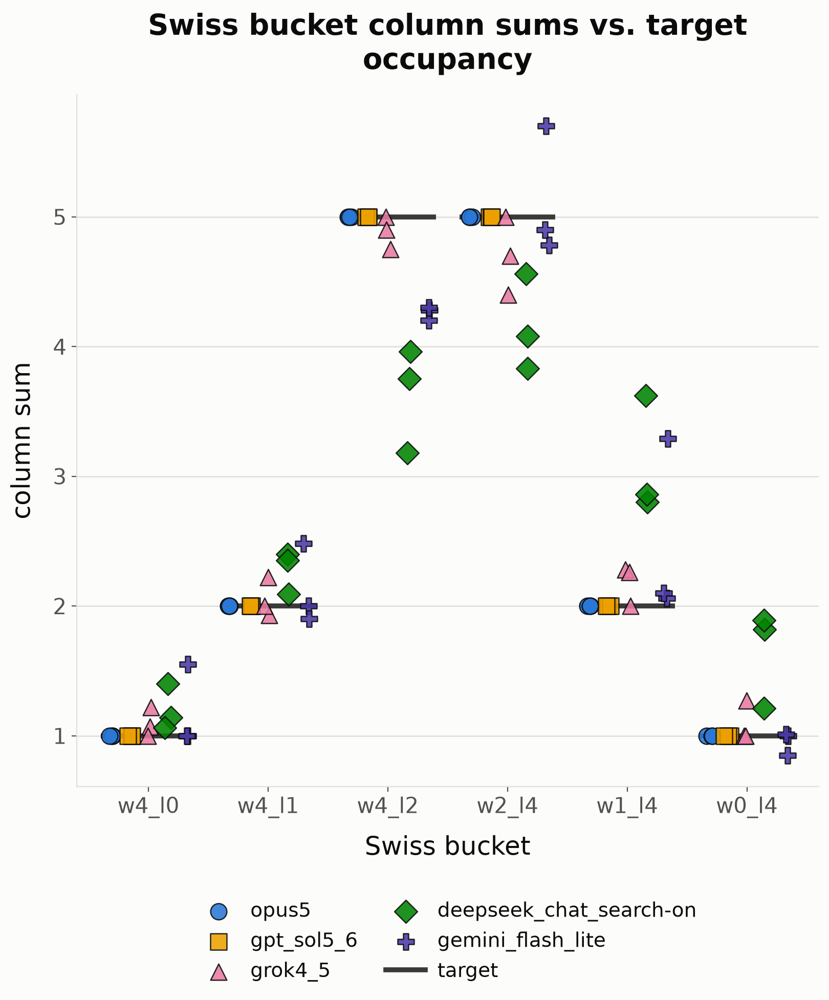

# TI 2026 LLM Prediction Benchmark

A pre-registered benchmark of how well frontier LLMs forecast The International 2026 (Dota 2) — and, more to the point, whether their probability estimates are internally coherent.

Everything in this repo was frozen and pushed **before the first match on 13 August 2026**. Nothing in `context_pack.md`, `prompt.md`, `prompt_assembled.md`, or `runs/` has been touched since.

## What this is, and why

Asking a model "who wins?" produces a name, and a name is almost impossible to score. Asking for a full probability distribution produces something you can check twice: once against reality after the fact, and once against arithmetic **right now**.

That second check is what this half of the project is about. The Swiss stage of TI has a rigidly fixed shape — sixteen teams, six terminal buckets, a known number of teams in each. That means a valid forecast has to satisfy four constraints that are true regardless of who actually wins. A model can be wrong about Dota and still satisfy them. A model that violates them isn't wrong about Dota; it's producing numbers that cannot describe any possible tournament.

So this is really two experiments stacked:

1. **Coherence** (this document) — does the model produce a well-formed probability object at all? Needs no results, testable the moment the runs are in.
2. **Calibration and accuracy** (after 23 August) — were the well-formed forecasts any good, compared with betting markets, a prediction market, and a uniform prior?

## Methodology

**Five models, three runs each, fifteen runs total.**

| Model | Directory key |
|---|---|
| Claude Opus 5 | `opus5` |
| GPT Sol 5.6 | `gpt_sol5_6` |
| Grok 4.5 | `grok4_5` |
| DeepSeek Chat (search on) | `deepseek_chat_search-on` |
| Gemini Flash Lite | `gemini_flash_lite` |

Every run was made in a **fresh chat**. Chat interfaces expose no temperature control, so a new conversation is the only available way to draw an independent sample. Web search was enabled for all five.

**One frozen input.** All fifteen runs received the identical briefing: [`context_pack.md`](context_pack.md). The instruction wrapper is [`prompt.md`](prompt.md); the exact assembled text that was actually pasted into each chat — wrapper plus briefing, verbatim — is [`prompt_assembled.md`](prompt_assembled.md). Nothing was said to any model beyond that single message: no follow-ups, no corrections, no "please fix your JSON."

**The ask.** For each of the 16 teams, a probability distribution over the six Swiss buckets (a 16×6 matrix), plus that team's probability of winning the tournament outright.

| Bucket | Record | Teams | Outcome |
|---|---|---|---|
| `w4_l0` | 4–0 | 1 | advances |
| `w4_l1` | 4–1 | 2 | advances |
| `w4_l2` | 4–2 | 5 | advances |
| `w2_l4` | 2–4 | 5 | eliminated |
| `w1_l4` | 1–4 | 2 | eliminated |
| `w0_l4` | 0–4 | 1 | eliminated |

**The four checkable constraints**, stated explicitly in the prompt (Valve publishes the bucket occupancies in the client, so hiding them would only have made the task ambiguous):

1. Each team's six bucket probabilities sum to **1.0**
2. Each bucket column sums to its occupancy: **1, 2, 5, 5, 2, 1**
3. `p_champion` across all sixteen teams sums to **1.0**
4. For each team, `p_champion` ≤ the sum of its three advancing buckets (nesting)

Constraints 1–3 are arithmetic. Constraint 4 is logical: you cannot win a tournament you did not reach.

**No hand-editing.** Files in `runs/` are raw model output. Where a model returned malformed JSON, that is data, and [`score.py`](score.py) parses defensively rather than the file being fixed by hand.

## Coherence results

All fifteen runs parsed at level 1 — valid JSON, exact schema, no mechanical recovery needed by any model.

| Model | Rows = 1.0 | Columns = 1-2-5-5-2-1 | Σ champion = 1.0 | Nesting | Runs clean |
|---|---|---|---|---|---|
| `opus5` | ✅ | ✅ | ✅ | ✅ | **3 / 3** |
| `gpt_sol5_6` | ✅ | ✅ | ✅ | ✅ | **3 / 3** |
| `grok4_5` | ✅ | ❌ max dev 0.60 | ❌ 1.110 (run 3) | ✅ | 1 / 3 |
| `deepseek_chat_search-on` | ✅ | ❌ max dev **1.82** | ❌ 1.201 (run 3) | ✅ | 0 / 3 |
| `gemini_flash_lite` | ❌ 0.40 (run 3) | ❌ max dev 1.29 | ❌ 0.985, 0.970 | ❌ 7 violations | 0 / 3 |

The headline numbers:

- **Rows are easy.** Across all fifteen runs there is exactly **one** row-sum violation — `gemini_flash_lite` run 3, deviation 0.40. Fourteen of fifteen runs got every one of their sixteen rows to sum to 1.0. This is the constraint models normalise for instinctively.
- **Columns are hard.** The worst single column deviation is **1.82**: `deepseek_chat_search-on` run 2 put a total of **3.18** teams into `w4_l2`, a bucket that holds exactly **5**. Eight of fifteen runs miss at least one column, against one that misses a row. Rows are a local normalisation over six numbers a model is writing at once; columns are a global sum over sixteen teams written far apart in the output, and that is where coherence goes.
- **The champion column fails in four runs** — sums of **1.201**, **1.110**, **0.985**, and **0.970**. Note the direction: the two worst are both *over* 1.0, meaning more than one champion in expectation.
- **Nesting violations belong to one model.** `gemini_flash_lite` produced six in run 2 and one in run 3 — teams assigned a nonzero chance of winning TI and a zero chance of getting out of the group stage. No other model violated it once.
- **Opus 5 and GPT Sol 5.6 held all four constraints in all three runs.** Every column, every row, both champion sums, exact.



*Each point is one model's column sum for one bucket in one run; the horizontal bars are the fixed occupancies. Reproduce with `py score.py charts`.*

### The noise floor

Three runs per model is a small sample, so before comparing any two models we need to know how much a single model disagrees with *itself*. For each team we take the sample standard deviation (N−1) of its value across that model's three runs, then average over the sixteen teams. Bessel's correction matters here: three runs are a sample used to estimate the model's true run-to-run noise, not the whole population, and population stdev would understate it by ~1.225× at N=3 — which would in turn inflate how significant every between-model gap looks.

| Model | `p_champion` | Bucket spread (min – max across the six buckets) |
|---|---|---|
| `opus5` | 0.0072 | 0.0040 – 0.0117 |
| `gpt_sol5_6` | 0.0060 | 0.0075 – 0.0200 |
| `grok4_5` | 0.0080 | 0.0101 – 0.0299 |
| `deepseek_chat_search-on` | 0.0124 | 0.0207 – 0.0336 |
| `gemini_flash_lite` | 0.0072 | 0.0271 – **0.1034** |

On champion probability all five models sit in a narrow band, **0.0060 to 0.0124** — re-running the same prompt in a fresh chat moves a team's title odds by about one percentage point, and that is true of the coherent models and the incoherent ones alike.

On the buckets they separate by a factor of twenty-five, from **0.0040** (`opus5`) to **0.1034** (`gemini_flash_lite`). The ordering is the same as the coherence ordering. That is not proof of a causal link on n=3, but it is consistent with a single underlying property: the models that keep the constraints are also the models that give you the same answer twice.

### Baselines

Three kinds of baseline are registered, and the market ones are deliberately **not merged**:

| Baseline | What it is | Σ raw implied probability |
|---|---|---|
| `esportbet_aggregate` | aggregated bookmaker decimal odds | **1.5303** |
| `polymarket` | prediction market, prices taken at **ask** (so they include the spread) | **1.1757** |
| `uniform` | 0.5 to advance, 1/16 to win | 1.0 by construction |
| `ensemble` | mean across all fifteen runs | see below |

Each market source is normalised **within its own group** and scored as its own entrant. Averaging them before normalising would let the higher-margin source dominate; averaging after normalising would quietly erase the disagreement between them — and the disagreement is large. After normalisation the two sources differ by up to **10.7×** on a single team (HULIGANI: 0.0363 from the bookmakers, 0.0034 on Polymarket), with four teams differing by more than 4×. That spread is a result worth reporting, not noise to average away.

Both market sources price only the outright winner. Neither has a distribution over the six Swiss buckets, so both are **champion-only**: they take part in champion Brier and champion log loss, and are reported as `N/A` — explicitly, never as a substituted zero — on every bucket-level metric. The uniform prior is the only baseline scored on buckets alongside the models and the ensemble.

Odds snapshot: `2026-08-10T14:00+02:00`, both sources, recorded in [`odds.csv`](odds.csv) with the source URL per row. It was taken in sync with the context-pack freeze and the model runs, deliberately — a later snapshot would give the market baselines days of news the models never saw, and the comparison would stop being fair. The date does not move, even if the lines do.

### The ensemble does not fix incoherence

Averaging the fifteen runs together produces column sums of:

| `w4_l0` | `w4_l1` | `w4_l2` | `w2_l4` | `w1_l4` | `w0_l4` | Σ champion |
|---|---|---|---|---|---|---|
| 1.096 | 2.091 | 4.555 | 4.797 | 2.351 | 1.137 | 1.018 |

against targets of 1, 2, 5, 5, 2, 1 and 1.0. The ensemble inherits the incoherence of its members. Averaging inconsistent forecasts does not restore consistency — it produces a forecast that is wrong by less, in the same direction, and still describes no possible tournament. Worth stating plainly, because "just ensemble it" is the standard reflex and the constraint violations here are structural, not random noise that cancels.

## Limitations

Stated up front rather than buried, because several of them are real.

- **Three runs per model is a small sample.** No model ranking is claimed from this data, and none should be read into it. Within-model spread is comparable to between-model differences on most quantities. Nothing in either LinkedIn post asserts one model beats another unless the gap exceeds the within-model spread.
- **No canonical team-name list was put in the prompt.** `prompt.md` says to "use the exact team names listed in the briefing," but `context_pack.md` presents three teams under two textual forms each — a compact section header (`BoomBoys / BetBoom Team`, `Team Vision / PARIVISION`, `HULIGANI (ex-L1GA TEAM)`) and, separately, an explicit "X plays as Y" sentence — and never says which is *the* name. GPT Sol 5.6 returned the section-header form verbatim for all three; every other model normalised to the short form unprompted. **This is a gap in our specification, not a model error** — GPT followed the literal instruction. `score.py` maps exactly those three strings to canonical names via a `TEAM_SPEC_AMBIGUITY` table, and doing so does *not* downgrade the run's parse level and does *not* count as a repair. Every occurrence is logged and printed in the coherence report.
- **DeepSeek's expert mode is absent** because it has no web access, and web search was a condition of the run. The model here is the light chat model with search on.
- **Google is represented by a light model.** The flagship Gemini is not available without payment, so `gemini_flash_lite` stands in. It is also the worst performer on coherence — those two facts should be read together, and no conclusion about Google's frontier model follows from this data.
- **Web search was available to all five models and used by none of them.** The intended contrast between searching and non-searching models therefore did not materialise. Everything below is knowledge-cutoff forecasting plus the briefing.
- **The context pack is knowingly incomplete.** Section 5 of `context_pack.md` enumerates its own gaps: no odds, no power rankings, no round-one pairings (unpublished at freeze), and only one fully tabulated tier-1 event because aggregator sources contradicted each other on the rest.
- **Runs are not temperature-controlled.** Chat interfaces do not expose the setting. The GPT runs were additionally produced by a third party on their own account, so those settings are not under our control at all.

## What's next

The forecasts are frozen and pushed before the first match on **13 August 2026, 04:00 CEST**. That push is the pre-registration; nothing in the inputs or the runs changes after it.

After the grand final on **23 August**, [`results.csv`](results.csv) gets filled in and the second half runs:

- Multiclass Brier score and log loss over the six buckets
- Binary Brier for advancing (top 8) and for champion
- Reliability diagram, predictions binned by 0.1
- Every between-model difference plotted against the within-model spread from above. Where a gap sits inside the noise floor, it gets reported as sitting inside the noise floor — that is the honest finding, not a failed experiment
- All of it against the four baselines: two market sources scored separately, uniform, and the ensemble

## Reproducing

Python 3.11+. The coherence half is standard-library only.

```
py score.py coherence            # everything in this document
py score.py score                # post-tournament metrics (needs results.csv)
py score.py charts               # regenerates charts/column_sums.png
py tests/test_coherence.py       # and the other test_*.py in tests/
```

`charts` is the only command with a dependency — `pip install -r requirements.txt` (matplotlib).

Every number in this README and in both LinkedIn posts comes out of `score.py`. All reported probabilities are normalised; raw values such as `1/decimal_odds` before overround is divided out appear only in the scale-diagnostics table, which prints every probability column's sum and errors if a column marked normalised misses its expected total by more than `1e-6`.

## Repo layout

```
context_pack.md      frozen briefing given to every model
prompt.md            the instruction wrapper, with paste marker
prompt_assembled.md  the exact text sent, wrapper + briefing
runs/                {model}_run_{n}.json -- raw, unedited
odds.csv             market snapshot, 2026-08-10
results.csv          actual outcomes, filled after 08-23
score.py             parsing, coherence, scoring, charts
charts/              generated PNGs
tests/               fixtures with hand-derived expected values
CLAUDE.md            full methodology and the record of design decisions
```
